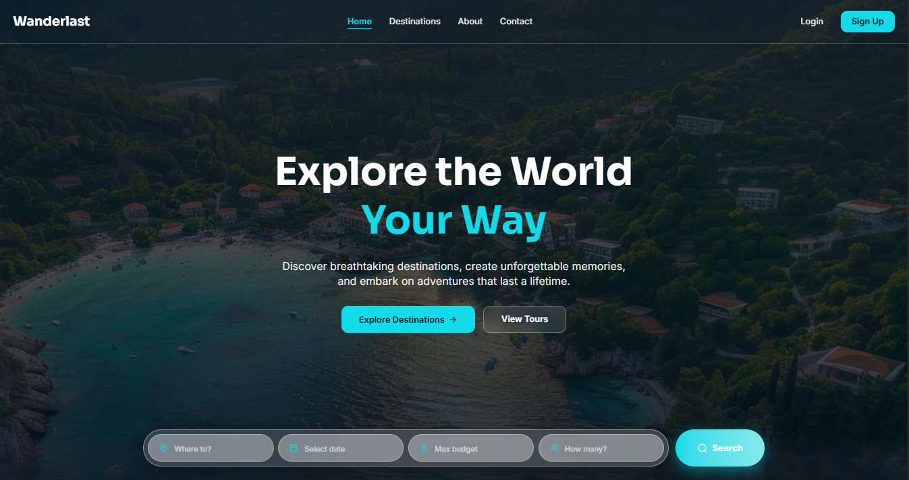
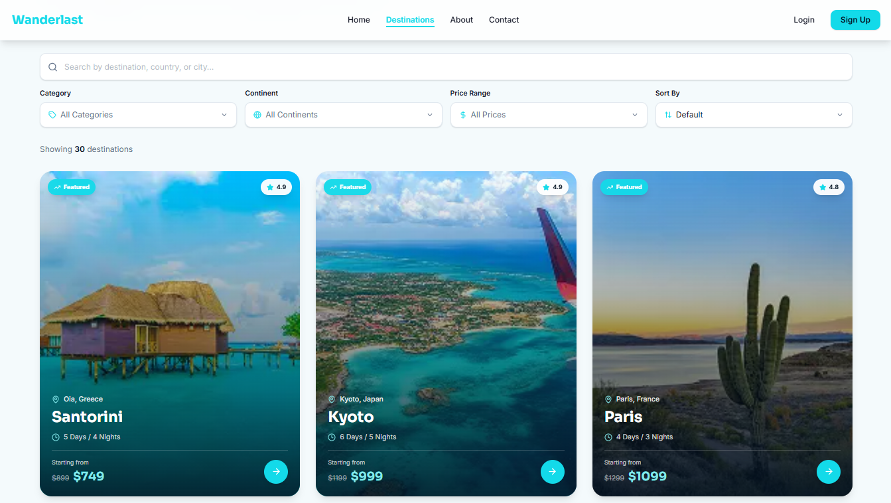

<div align="center">

# WanderLast

### Curated Travel Experiences for Modern Explorers

A polished full-stack travel booking platform where users can discover famous city destinations, explore detailed travel packages, sign in securely, book trips, and manage their travel profile.

[](https://wanderlustweb.vercel.app/)
[](https://nextjs.org/)
[](https://react.dev/)
[](https://tailwindcss.com/)
[](https://www.better-auth.com/)
[](https://www.mongodb.com/)
[](https://expressjs.com/)
[](https://wanderlustweb.vercel.app/)

</div>

---

## 📸 Preview

<p align="center">
  
  
</p>

> **🔗 Live Site:** [https://wanderlustweb.vercel.app/](https://wanderlustweb.vercel.app/)  
> **⚙️ Server API:** [https://wanderlustwebserver.vercel.app/](https://wanderlustwebserver.vercel.app/)  
> **🧭 Destinations API:** [https://wanderlustwebserver.vercel.app/destinations](https://wanderlustwebserver.vercel.app/destinations)

---

## ✨ Features

| Feature                             | Description                                                                                  |
| :---------------------------------- | :------------------------------------------------------------------------------------------- |
| 🏙️ **Destination Discovery**        | Browse, search, filter, and sort curated city travel packages across global destinations      |
| ⭐ **Featured City Picks**          | Homepage carousel highlights the best city destinations with ratings, pricing, and duration   |
| 📍 **Detailed Destination Pages**   | View trip overview, highlights, included services, best season, difficulty, and availability  |
| 📅 **Travel Booking Flow**          | Authenticated users can book destinations with traveler count and departure date              |
| 👤 **Profile Dashboard**            | Users can view account details, travel stats, recent activity, and connected auth providers   |
| 🧳 **My Bookings**                  | Travelers can review upcoming/completed bookings and cancel reservations securely             |
| 🔐 **Better Auth Login**            | Email/password authentication plus Google social sign-in with secure sessions                 |
| 🛡️ **JWT-Protected API**            | Backend verifies Better Auth JWTs through JWKS before allowing bookings or admin actions      |
| 🧑‍💼 **Admin Destination CRUD**      | Admin users can create, update, and delete destination packages from protected routes          |
| 📱 **Responsive UI**                | Fully responsive layouts for desktop, tablet, mobile, and large screens                      |

---

## 🛠️ Tech Stack

<div align="center">

|         Technology          |                              Purpose                               |
| :-------------------------: | :----------------------------------------------------------------: |
|       **Next.js 16**        |       App Router, server-rendered pages, routing, and API auth      |
|        **React 19**         |                    Component-driven frontend UI                    |
|      **Tailwind CSS 4**     |             Utility-first responsive application styling           |
|       **HeroUI React**      |              Accessible form controls and UI primitives            |
|       **Better Auth**       |          Authentication, sessions, Google OAuth, and JWTs          |
|        **MongoDB 7**        |        Destination, booking, session, user, and account storage     |
|        **Express 5**        |                    Standalone backend API server                   |
|       **jose-cjs**          |          JWT verification against Better Auth JWKS endpoints        |
|      **Lucide React**       |             Consistent icon system across the application           |
|      **React Icons**        |                   Brand icons such as Google sign-in               |
|         **Vercel**          |                  Frontend and backend deployment                   |

</div>

---

## 📁 Project Structure

```text
wanderlust/
├── client/
│   ├── public/
│   │   ├── preview1.png
│   │   └── preview2.png
│   ├── src/
│   │   ├── app/
│   │   │   ├── api/auth/[...all]/
│   │   │   ├── bookings/
│   │   │   ├── destinations/
│   │   │   ├── profile/
│   │   │   ├── signin/
│   │   │   ├── signup/
│   │   │   ├── layout.jsx
│   │   │   └── page.jsx
│   │   ├── assets/
│   │   ├── components/
│   │   │   ├── auth/
│   │   │   ├── bookings/
│   │   │   ├── destination-details/
│   │   │   ├── destination-form/
│   │   │   ├── destinations/
│   │   │   ├── home/
│   │   │   ├── profile/
│   │   │   └── ui/
│   │   ├── hooks/
│   │   ├── lib/
│   │   │   ├── api-client.js
│   │   │   ├── auth-client.js
│   │   │   ├── auth.js
│   │   │   ├── data.js
│   │   │   └── local-images.js
│   │   └── proxy.js
│   ├── package.json
│   └── next.config.mjs
├── server/
│   ├── scripts/
│   │   └── seed-best-cities.js
│   ├── index.js
│   ├── package.json
│   └── vercel.json
└── README.md
```

---

## 🎨 Design Highlights

- **Immersive travel homepage** with a full-bleed visual hero, CTA sections, testimonials, and trust-building content
- **Best Cities For Travel carousel** showcasing curated city packages with ratings, discounts, and quick navigation
- **Destination catalog interface** with search, category filtering, continent filtering, price filtering, sorting, and empty states
- **Detailed booking pages** with travel highlights, included services, availability, trip duration, difficulty, and pricing
- **Authenticated app shell** that adapts navigation links and dropdown actions based on session state
- **Profile experience** with user avatar handling, travel stats, recent bookings, account details, and password/profile updates
- **Consistent visual language** using cyan accents, deep navy contrast, rounded cards, lucide icons, and responsive spacing

---

## 🔐 Environment Variables

This project has separate environment files for the client and server.

### Client: `client/.env`

```env
# Backend API
NEXT_PUBLIC_API_BASE_URL=http://localhost:5000

# Public app URLs
NEXT_PUBLIC_APP_URL=http://localhost:3000
NEXT_PUBLIC_BETTER_AUTH_URL=http://localhost:3000
BETTER_AUTH_URL=http://localhost:3000

# MongoDB Atlas for Better Auth
MONGODB_URI=your_mongodb_connection_string
MONGODB_DB=wanderlast

# Better Auth
BETTER_AUTH_API_KEY=your_better_auth_dashboard_api_key

# Google OAuth
GOOGLE_CLIENT_ID=your_google_oauth_client_id
GOOGLE_CLIENT_SECRET=your_google_oauth_client_secret
```

### Server: `server/.env`

```env
PORT=5000
CLIENT_URL=http://localhost:3000
MONGODB_URI=your_mongodb_connection_string
MONGODB_DB=wanderlast
```

## 🚀 Getting Started

Clone the repository:

```bash
git clone <repository-url>
cd wanderlust
```

Install client dependencies:

```bash
cd client
npm install
```

Install server dependencies:

```bash
cd ../server
npm install
```

Run the backend API:

```bash
cd server
npm run dev
```

Run the frontend app:

```bash
cd client
npm run dev
```

Open the app:

```text
http://localhost:3000
```

Build for production:

```bash
cd client
npm run build

cd ../server
npm run build
```


## 📡 API Endpoints

### Public Routes

| Method | Endpoint            | Description                          |
| :----- | :------------------ | :----------------------------------- |
| GET    | `/`                 | Server status check                  |
| GET    | `/health`           | JSON health response                 |
| GET    | `/destinations`     | Fetch all destination packages       |
| GET    | `/destinations/:id` | Fetch a single destination by ID     |

### Protected Routes

These routes require an `Authorization` header:

```http
Authorization: Bearer <better_auth_jwt>
```

| Method | Endpoint            | Access      | Description                         |
| :----- | :------------------ | :---------- | :---------------------------------- |
| POST   | `/bookings`         | User        | Create a booking                    |
| GET    | `/bookings/:userId` | Owner       | Fetch bookings for a signed-in user |
| DELETE | `/bookings/:id`     | Owner       | Cancel/delete a booking             |
| POST   | `/destinations`     | Admin       | Create a destination package        |
| PATCH  | `/destinations/:id` | Admin       | Update a destination package        |
| DELETE | `/destinations/:id` | Admin       | Delete a destination package        |

---

## 🔒 Authentication

WanderLast uses **Better Auth** in the Next.js app for:

- Email/password sign-up and sign-in
- Google social login
- Session cookies
- User profile updates
- Password changes
- JWT issuing through the Better Auth JWT plugin

The Express API verifies protected requests using Better Auth's JWKS endpoint:

```text
<CLIENT_URL>/api/auth/jwks
```

Admin-only routes require a verified JWT payload with:

```text
role=admin
```

---

## 🌐 Deployment

The application is deployed on **Vercel**:

**Frontend Live URL:** [https://wanderlustweb.vercel.app/](https://wanderlustweb.vercel.app/)  
**Backend Live URL:** [https://wanderlustwebserver.vercel.app/](https://wanderlustwebserver.vercel.app/)

For deployment:

1. Add all production environment variables in the frontend and backend Vercel project settings.
2. Set `BETTER_AUTH_URL` to `https://wanderlustweb.vercel.app`.
3. Set `NEXT_PUBLIC_APP_URL` to `https://wanderlustweb.vercel.app`.
4. Set `NEXT_PUBLIC_API_BASE_URL` to `https://wanderlustwebserver.vercel.app`.
5. Set backend `CLIENT_URL` to `https://wanderlustweb.vercel.app`.
6. Configure Google OAuth authorized JavaScript origins and redirect URLs for the production domain.
7. Allow Vercel/production access in MongoDB Atlas Network Access.
8. Redeploy both projects after changing environment variables.

---

## 📋 Prerequisites

- [Node.js](https://nodejs.org/) `20` or higher
- [MongoDB Atlas](https://www.mongodb.com/atlas) connection string
- [Google Cloud OAuth credentials](https://console.cloud.google.com/apis/credentials)
- Vercel account for deployment

---

## 📜 License

This project is licensed under the **ISC License**.

---

<div align="center">

**⭐ If you found this project useful, consider giving it a star!**

Made with ❤️ using Next.js, React, Tailwind CSS, Better Auth, MongoDB, Express, and Vercel

</div>
